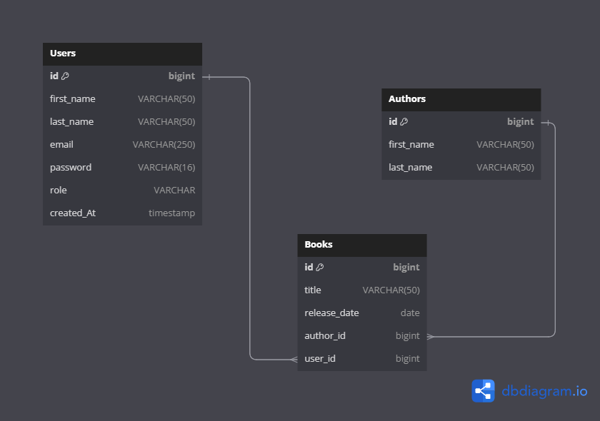

## Reading Management System.

I've tried to keep the schema as simple as possible as the only goal of this task was to implement what we've learned in the OOP semester.
so my focus was on applying OOP examples as much as needed, and I've used my backend knowledge working with a database to implement a `GUI`
application that glues OOP + database + GUI programming together.

## Tool
- Database -> `mysql`
- GUI framework -> `JavaFX`
- IDE -> `Intellij IDEA community edition`

## Features

This is a simple `reading management` system which:
- the user can authenticate himself by signing up and logging in to the system
- the user can add, remove, delete, and update books based on progress.
- the user can export data to `Excel` sheet for further analysis

## PoC (Proof of Concept)
This is a demo of the running application

https://github.com/MrBomber0x001/Library-Management-Java/assets/42917814/4c6fe20d-2687-4c76-96da-83a9388fe14c


## DB schema



```sql
CREATE TABLE `users` (
  `user_id` int AUTO_INCREMENT NOT NULL PRIMARY KEY,
  `username` VARCHAR(250),
  `email` VARCHAR(250),
  `password` VARCHAR(16),
  `gender` VARCHAR(250)
);

CREATE TABLE `books` (
  `id` int AUTO_INCREMENT NOT NULL PRIMARY KEY,
  `title` VARCHAR(50),
  `author_name` VARCHAR(50),
  `user_id` int
);


ALTER TABLE `books` ADD CONSTRAINT `fk_books_users` FOREIGN KEY (`user_id`) REFERENCES `users` (`user_id`);
```


## TODO and log
- [x] Implement user authentication (signup, login)
- [x] Implement Book adding feature, prefetching the books for registered or already logged in users
- [x] Implement Book Updating/Deletion
- [x] Implement Export to Excel Functionality
- [x] <https://stackoverflow.com/questions/27556536/javafx-scene-layout-pane-cannot-be-cast-to-javafx-fxml-fxmlloader>
- [x] Change the schema
- [x] Read about `ObservalList` (needed to update TableColumns in time);
- [ ] implement UML design and presentation.
- [x] upload the new PoC
- [ ] FUTURE -> (Refactor totalBook count to be based on tableView rows count only instead of the database)
- [ ] FUTURE -> Package the application & Dockersize.
